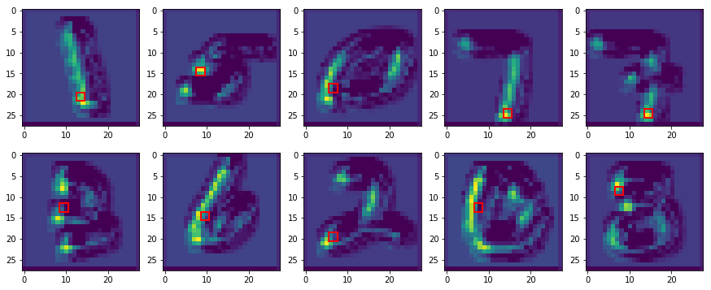

# spatial_softmax-pytorch

- [End-to-End Training of Deep Visuomotor Policies](https://arxiv.org/pdf/1504.00702.pdf)
- [Deep Spatial Autoencoders for Visuomotor Learning](https://arxiv.org/pdf/1509.06113.pdf)
- [original implementation](https://github.com/cbfinn/gps/blob/82fa6cc930c4392d55d2525f6b792089f1d2ccfe/python/gps/algorithm/policy_opt/tf_model_example.py#L168)

# MNIST classification
- using only 4 [x,y]

- mnist acc >> 90%

- feature0

- feature1

- feature2

- feature3

